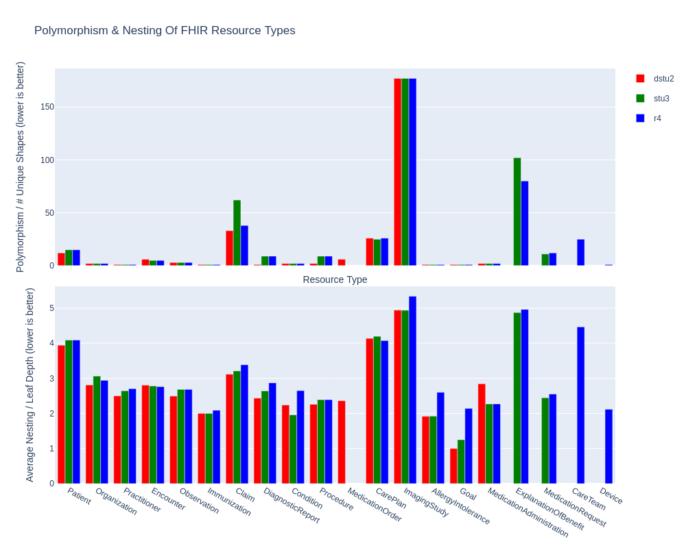
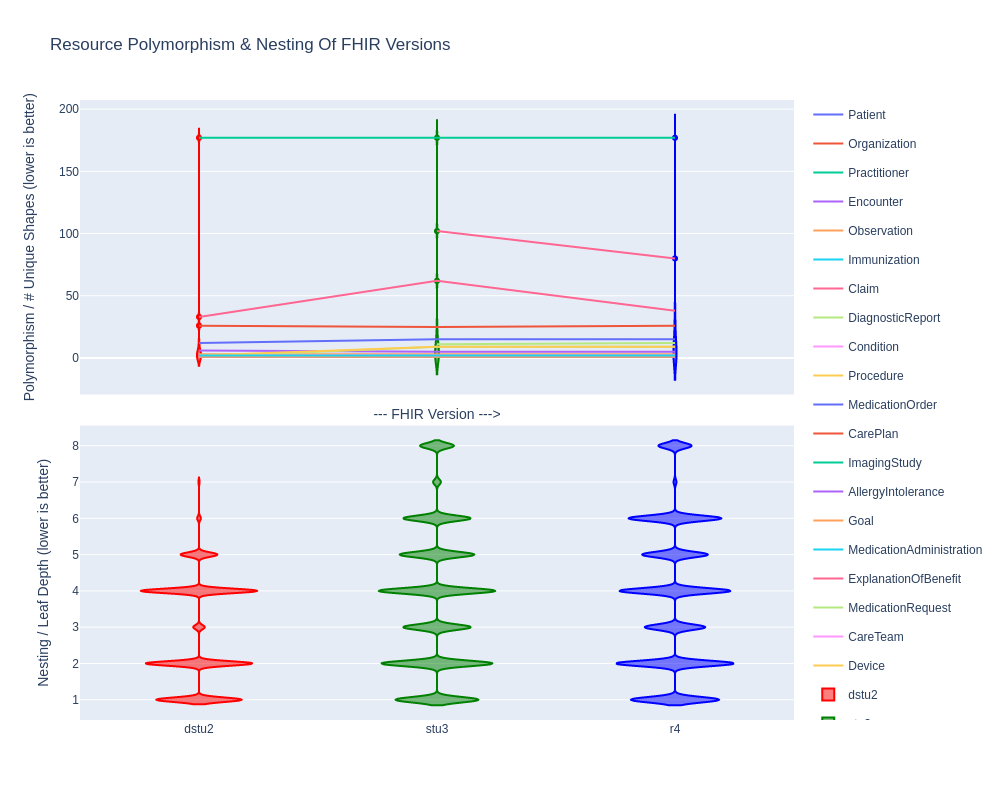

# measure polymorphism and nesting of FHIR resource types across versions

caveat: this repo uses synthetic data -- it would be awesome to apply this to real-world FHIR data

## usage
```bash
gh repo clone bionicles/playing_with_fhir
cd playing_with_fhir

conda create -n py39 python=3.9
conda activate py39

pip install rich, numpy, plotly

# go to https://synthetichealth.github.io/synthea/
# download the dstu2, stu3, and r4 datasets 
# extract the json into the data/$VERSION folders
# or run this script to do it for you:
python wrangle.py

# group the fhir resources by version and type
# analyze their polymorphism and nesting
python fhir.py
```

## results





## worst offenders in FHIR r4

- the resource type with the most inconsistent data:
    - ImagingStudy, with 177 unique shapes in a sample of 977 ImagingStudy instances

- the resource type with most deeply nested data (on average):
    - ImagingStudy, which requires an average of 5.3384820406218125 operations to access each leaf

- the resource type with most deeply nested data (worst case):
    - ExplanationOfBenefit, which has a leaf which requires 8 operations to access

- see output.txt for full results

# License / Contributing / Links

- MIT license, please feel free to use it for anything
- Pull requests are welcome - ping me via email or signal if I'm too slow
- The data is from https://synthetichealth.github.io/synthea/
- Discussion: https://chat.fhir.org/#narrow/stream/179166-implementers/topic/re.3A.20Polymorphism.2C.20Nesting.2C.20Validation
- FHIR publication / version history: http://hl7.org/fhir/directory.html


